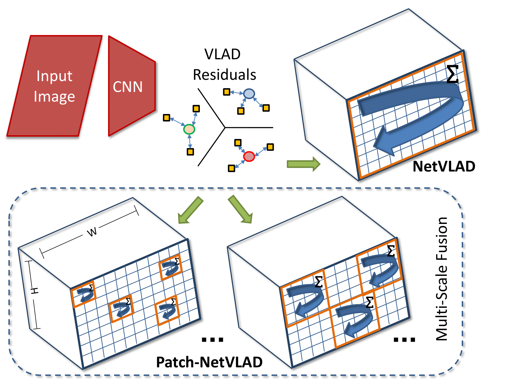
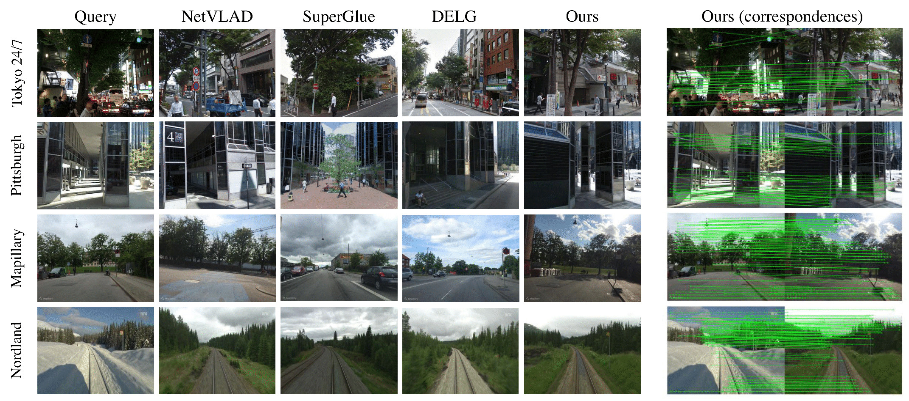

# Patch-NetVLAD: Multi-Scale Fusion of Locally-Global Descriptors for Place Recognition
[](https://creativecommons.org/licenses/by-nc-sa/4.0/)
[](https://github.com/QVPR/Patch-NetVLAD/stargazers)
[](https://github.com/QVPR/Patch-NetVLAD/issues)
[](https://github.com/QVPR/Patch-NetVLAD/issues?q=is%3Aissue+is%3Aclosed)
[](./README.md)
[](https://qcr.github.io/collection/vpr_overview/)

[](https://paperswithcode.com/sota/visual-localization-on-extended-cmu-seasons?p=patch-netvlad-multi-scale-fusion-of-locally)
[](https://paperswithcode.com/sota/visual-place-recognition-on-mapillary-val?p=patch-netvlad-multi-scale-fusion-of-locally)
[](https://paperswithcode.com/sota/visual-place-recognition-on-nordland?p=patch-netvlad-multi-scale-fusion-of-locally)
[](https://paperswithcode.com/sota/visual-place-recognition-on-pittsburgh-30k?p=patch-netvlad-multi-scale-fusion-of-locally)
[](https://paperswithcode.com/sota/visual-localization-on-robotcar-seasons-v2?p=patch-netvlad-multi-scale-fusion-of-locally)
[](https://paperswithcode.com/sota/visual-place-recognition-on-tokyo247?p=patch-netvlad-multi-scale-fusion-of-locally)

This repository contains code for the CVPR2021 paper "Patch-NetVLAD: Multi-Scale Fusion of Locally-Global Descriptors for Place Recognition"

The article can be found on [arXiv](https://arxiv.org/abs/2103.01486) and the [official proceedings](https://openaccess.thecvf.com/content/CVPR2021/html/Hausler_Patch-NetVLAD_Multi-Scale_Fusion_of_Locally-Global_Descriptors_for_Place_Recognition_CVPR_2021_paper.html).

<p style="width: 50%; display: block; margin-left: auto; margin-right: auto">
  
</p>

## License + attribution/citation

When using code within this repository, please refer the following [paper](https://openaccess.thecvf.com/content/CVPR2021/html/Hausler_Patch-NetVLAD_Multi-Scale_Fusion_of_Locally-Global_Descriptors_for_Place_Recognition_CVPR_2021_paper.html) in your publications:
```
@inproceedings{hausler2021patchnetvlad,
  title={Patch-NetVLAD: Multi-Scale Fusion of Locally-Global Descriptors for Place Recognition},
  author={Hausler, Stephen and Garg, Sourav and Xu, Ming and Milford, Michael and Fischer, Tobias},
  booktitle={Proceedings of the IEEE/CVF Conference on Computer Vision and Pattern Recognition},
  pages={14141--14152},
  year={2021}
}
```

The code is licensed under the [MIT License](./LICENSE).

## Installation
We recommend using conda (or better: mamba) to install all dependencies. If you have not yet installed conda/mamba, please download and install [`mambaforge`](https://github.com/conda-forge/miniforge).

```bash
conda create -n patchnetvlad python=3.8 numpy pytorch-gpu torchvision natsort tqdm opencv pillow scikit-learn faiss matplotlib-base -c conda-forge

conda activate patchnetvlad
```

We provide several pre-trained models and configuration files. The pre-trained models will be downloaded automatically into the `pretrained_models` the first time feature extraction is performed.

<details>
  <summary>Alternatively, you can manually download the pre-trained models into a folder of your choice; click to expand if you want to do so.</summary>

  We recommend downloading the models into the `pretrained_models` folder (which is setup in the config files within the `configs` directory):

  ```bash
  # Note: the pre-trained models will be downloaded automatically the first time feature extraction is performed
  # the steps below are optional!

  # You can use the download script which automatically downloads the models:
  python ./download_models.py

  # Manual download:
  cd pretrained_models
  wget -O mapillary_WPCA128.pth.tar https://cloudstor.aarnet.edu.au/plus/s/vvr0jizjti0z2LR/download
  wget -O mapillary_WPCA512.pth.tar https://cloudstor.aarnet.edu.au/plus/s/DFxbGgFwh1y1wAz/download
  wget -O mapillary_WPCA4096.pth.tar https://cloudstor.aarnet.edu.au/plus/s/ZgW7DMEpeS47ELI/download
  wget -O pittsburgh_WPCA128.pth.tar https://cloudstor.aarnet.edu.au/plus/s/2ORvaCckitjz4Sd/download
  wget -O pittsburgh_WPCA512.pth.tar https://cloudstor.aarnet.edu.au/plus/s/WKl45MoboSyB4SH/download
  wget -O pittsburgh_WPCA4096.pth.tar https://cloudstor.aarnet.edu.au/plus/s/1aoTGbFjsekeKlB/download
  ```
</details>

If you want to use the shortcuts `patchnetvlad-match-two`, `patchnetvlad-feature-match` and `patchnetvlad-feature-extract`, you also need to run (which also lets you use Patch-NetVLAD in a modular way):
```bash
pip3 install --no-deps -e .
```


## Quick start

### Feature extraction
Replace `performance.ini` with `speed.ini` or `storage.ini` if you want, and adapt the dataset paths - examples are given for the Pittsburgh30k dataset (simply replace `pitts30k` with `tokyo247` or `nordland` for these datasets).

```bash
python feature_extract.py \
  --config_path patchnetvlad/configs/performance.ini \
  --dataset_file_path=pitts30k_imageNames_index.txt \
  --dataset_root_dir=/path/to/your/pitts/dataset \
  --output_features_dir patchnetvlad/output_features/pitts30k_index
```

Repeat for the query images by replacing `_index` with `_query`. Note that you have to adapt `dataset_root_dir`.

### Feature matching (dataset)
```bash
python feature_match.py \
  --config_path patchnetvlad/configs/performance.ini \
  --dataset_root_dir=/path/to/your/pitts/dataset \
  --query_file_path=pitts30k_imageNames_query.txt \
  --index_file_path=pitts30k_imageNames_index.txt \
  --query_input_features_dir patchnetvlad/output_features/pitts30k_query \
  --index_input_features_dir patchnetvlad/output_features/pitts30k_index \
  --ground_truth_path patchnetvlad/dataset_gt_files/pitts30k_test.npz \
  --result_save_folder patchnetvlad/results/pitts30k
```

Note that providing `ground_truth_path` is optional.

This will create three output files in the folder specified by `result_save_folder`:
- `recalls.txt` with a plain text output (only if `ground_truth_path` is specified)
- `NetVLAD_predictions.txt` with top 100 reference images for each query images obtained using "vanilla" NetVLAD in [Kapture format](https://github.com/naver/kapture)
- `PatchNetVLAD_predictions.txt` with top 100 reference images from above re-ranked by Patch-NetVLAD, again in [Kapture format](https://github.com/naver/kapture)

### Feature matching (two files)
```bash
python match_two.py \
--config_path patchnetvlad/configs/performance.ini \
--first_im_path=patchnetvlad/example_images/tokyo_query.jpg \
--second_im_path=patchnetvlad/example_images/tokyo_db.png
```

We provide the `match_two.py` script which computes the Patch-NetVLAD features for two given images and then determines the local feature matching between these images. While we provide example images, any image pair can be used.

The script will print a score value as an output, where a larger score indicates more similar images and a lower score means dissimilar images. The function also outputs a matching figure, showing the patch correspondances (after RANSAC) between the two images. The figure is saved as `results/patchMatchings.png`.

### Training
```bash
python train.py \
--config_path patchnetvlad/configs/train.ini \
--cache_path=/path/to/your/desired/cache/folder \
--save_path=/path/to/your/desired/checkpoint/save/folder \
--dataset_root_dir=/path/to/your/mapillary/dataset
```

To begin, request, download and unzip the Mapillary Street-level Sequences dataset (https://github.com/mapillary/mapillary_sls).
The provided script will train a new network from scratch, to resume training add --resume_path and set to a full path, filename and extension to an existing checkpoint file. Note to resume our provided models, first remove the WPCA layers.

After training a model, PCA can be added using add_pca.py.
```bash
python add_pca.py \
--config_path patchnetvlad/configs/train.ini \
--resume_path=full/path/with/extension/to/your/saved/checkpoint \
--dataset_root_dir=/path/to/your/mapillary/dataset
```

This will add an additional checkpoint file to the same folder as resume_path, except including a WPCA layer.

## FAQ


### How to Create New Ground Truth Files

We provide three ready-to-go ground truth files in the dataset_gt_files folder, however, for evaluation on other datasets you will need to create your own .npz ground truth data files.
Each .npz stores three variables: `utmQ` (a numpy array of floats), `utmDb` (a numpy array of floats) and `posDistThr` (a scalar numpy float).

Each successive element within `utmQ` and `utmDb` needs to correspond to the corresponding row of the image list file. `posDistThr` is the ground truth tolerance value (typically in meters).

The following mock example details the steps required to create a new ground truth file:
1. Collect GPS data for your query and database traverses and convert to utm format. Ensure the data is sampled at the same rate as your images.
2. Select your own choice of posDistThr value.
3. Save these variables using Numpy, such as this line of code:
`np.savez('dataset_gt_files/my_dataset.npz', utmQ=my_utmQ, utmDb=my_utmDb, posDistThr=my_posDistThr)`

## Acknowledgements
We would like to thank Gustavo Carneiro, Niko Suenderhauf and Mark Zolotas for their valuable comments in preparing this paper. This work received funding from the Australian Government, via grant AUSMURIB000001 associated with ONR MURI grant N00014-19-1-2571. The authors acknowledge continued support from the Queensland University of Technology (QUT) through the Centre for Robotics.

## Related works
Please check out [this collection](https://qcr.github.io/collection/vpr_overview/) of related works on place recognition.
